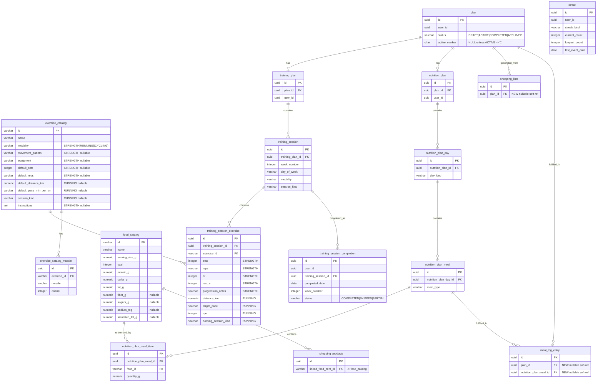
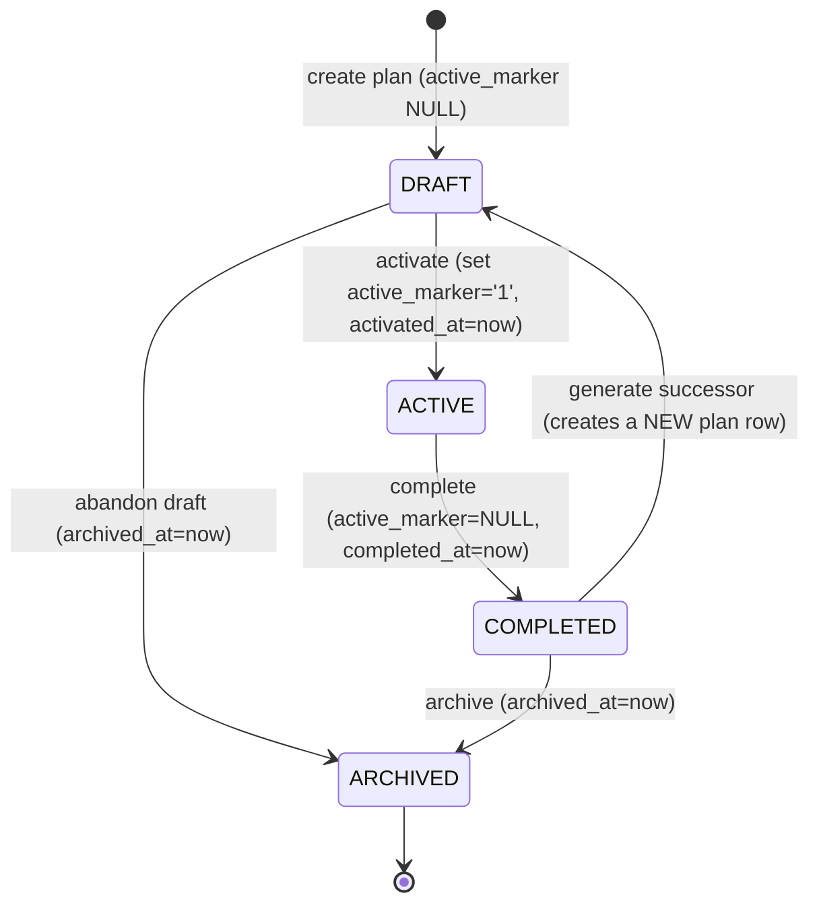

# ADR-011: Data model v2 (multi-user plans, catalogs, lifecycle)

## Status

Proposed (target: Accepted once the first-consumer catalog-seed story validates it against H2).

## Context

FORMA's plans, catalogs and completion history live only in code today (static
`FoodCatalog`, `ExerciseCatalog`, `WorkoutTemplateCatalog`, `RunningPlanGenerator`,
`NutritionDayCatalog`) or in a completion table (`training_session_status`, V3)
whose PK `"<DAY_OF_WEEK>:<KIND>"` (7 rows, always `PLAN_WEEK=1`) cannot represent
dated/weekly history. FOR-172..FOR-184 are queued to write migrations; without a
fixed model each would improvise incompatible tables.

Verified portability constraints force the design ONCE, centrally:

- H2 (tests run in `MODE=PostgreSQL`, real Flyway migrations against H2) has no
  native JSONB (h2database#1869) → no JSONB detail columns.
- H2 `CREATE [UNIQUE] INDEX` has no WHERE-clause grammar → a Postgres partial
  unique index is not portable.
- SQL `UNIQUE` is NULLS DISTINCT by default on both H2 and Postgres → the
  nullable-sentinel trick is portable.
- Convention verified across V1..V23: `UUID` PRIMARY KEY for identity,
  `VARCHAR(64)` for soft-link/natural-key ids, `NUMERIC(p,s)` for money/macros,
  `TIMESTAMP WITH TIME ZONE`, additive migrations, ONE `ADD COLUMN` per `ALTER`
  (a fresh `CREATE TABLE` may list all columns), unique invariants enforced via
  `CREATE UNIQUE INDEX` (V21 precedent), no FK to a `users` table (none exists
  yet).

Stale docs noted, NOT rewritten here: ADR-002 (auth, aspirational) and ADR-003
(persistence, omits Flyway/H2/one-`ALTER` conventions). This ADR records the
verified conventions it relies on and cross-references them; the rewrite is a
separate docs story / FOR-145.

## Decision

1. Exercise modality = single `exercise_catalog` table + nullable per-modality
   columns (no JSONB, no table-per-modality).
2. "One ACTIVE plan per user" = nullable sentinel `active_marker CHAR(1)` +
   `UNIQUE(user_id, active_marker)` (portable substitute for a partial index).
3. Identity = new v2 tables use `user_id UUID` from day one, with NO FK to
   `users` yet (FOR-145 adds it); a documented placeholder constant is used
   meanwhile.
4. Seed = reuse stable string ids verbatim as PKs; NULL for missing nutrients
   (never fabricated); materialize `RunningPlanGenerator` output once;
   migration-time referential-integrity validation replaces the static
   fail-fast check.
5. Plan boundary = a lightweight parent `plan` row + separate
   `training_plan`/`nutrition_plan` aggregates; a NEW dated
   `training_session_completion` table; `meal_log_entry` gains optional
   soft-ref columns instead of a rebuild.

### ERD of the v2 model (three zones)



Zone legend: (1) SHARED CATALOGS = global, `VARCHAR(64)` natural-key PKs, no
`user_id`. (2) PLAN AGGREGATE = `plan` parent + `training_plan`/`nutrition_plan`
children; all UUID PKs, carry `user_id`. (3) PER-USER HISTORY = dated
completion, streaks, and the evolved `meal_log_entry`. Body measurements
(`body_measurements`, v1) is existing per-user data, unchanged by this ADR.

### Table-by-table schema (NEW v2 tables)

Types are Postgres, chosen H2-compatible (plain typed columns, no JSONB). All
`TIMESTAMP` columns are `TIMESTAMP WITH TIME ZONE`. `created_at` defaults
`CURRENT_TIMESTAMP`.

#### ZONE 1 — Shared catalogs

**exercise_catalog** (global; PK reuses `ExerciseCatalog`/running ids verbatim)

| column | type | null | notes |
|---|---|---|---|
| id | VARCHAR(64) | PK | e.g. "dumbbell-bench-press" (verbatim) |
| name | VARCHAR(200) | NOT NULL | |
| modality | VARCHAR(32) | NOT NULL | STRENGTH \| RUNNING \| (future CYCLING/SWIMMING) |
| movement_pattern | VARCHAR(32) | NULL | STRENGTH: PUSH/PULL/SQUAT/HINGE/CORE |
| equipment | VARCHAR(32) | NULL | STRENGTH: DUMBBELL/BENCH/BAND/PULL_UP_BAR/BODYWEIGHT |
| default_sets | INTEGER | NULL | STRENGTH sets hint |
| default_reps | VARCHAR(16) | NULL | STRENGTH reps hint, e.g. "8-12" |
| default_distance_km | NUMERIC(5,2) | NULL | RUNNING distance hint |
| default_pace_min_per_km | VARCHAR(8) | NULL | RUNNING "mm:ss" text (matches `weekly_tracking_record`) |
| session_kind | VARCHAR(32) | NULL | RUNNING: EASY/LONG_RUN/INTERVALS/RECOVERY (verbatim `SessionType.name()`) |
| instructions | TEXT | NULL | STRENGTH authored cues (ES); NULL for RUNNING |
| created_at | TIMESTAMP WITH TIME ZONE | NOT NULL | default CURRENT_TIMESTAMP |

Index: `CREATE INDEX idx_exercise_catalog_modality ON exercise_catalog (modality);`

**exercise_catalog_muscle** (child of `exercise_catalog`; FOR-172 amendment — preserves the multi-muscle list that `MuscleWorkedMapService` consumes, which a single scalar `muscle_group` would have regressed)

| column | type | null | notes |
|---|---|---|---|
| id | UUID | PK | |
| exercise_id | VARCHAR(64) | NOT NULL | FK→`exercise_catalog(id)` |
| muscle | VARCHAR(64) | NOT NULL | one primary muscle (verbatim from `Exercise.primaryMuscles()`) |
| ordinal | INTEGER | NOT NULL | order within the exercise's muscle list |

Index: `CREATE INDEX idx_exercise_catalog_muscle_exercise ON exercise_catalog_muscle (exercise_id);`

**food_catalog** (global; PK reuses `FoodCatalog` ids verbatim → makes
`shopping_products.linked_food_item_id` FK-able)

| column | type | null | notes |
|---|---|---|---|
| id | VARCHAR(64) | PK | e.g. "oats", "chicken" (verbatim) |
| name | VARCHAR(200) | NOT NULL | |
| serving_size_g | NUMERIC(6,1) | NULL | reference basis if present |
| kcal | INTEGER | NOT NULL | required macro |
| protein_g | NUMERIC(6,1) | NOT NULL | required |
| carbs_g | NUMERIC(6,1) | NOT NULL | required |
| fat_g | NUMERIC(6,1) | NOT NULL | required |
| fiber_g | NUMERIC(6,1) | NULL | key nutrient, NULL when unverified |
| sugars_g | NUMERIC(6,1) | NULL | key nutrient, NULL when unverified |
| sodium_mg | NUMERIC(7,1) | NULL | key nutrient, NULL when unverified |
| saturated_fat_g | NUMERIC(6,1) | NULL | key nutrient, NULL when unverified |
| created_at | TIMESTAMP WITH TIME ZONE | NOT NULL | default CURRENT_TIMESTAMP |

#### ZONE 2 — Plan aggregate

**plan** (lightweight parent; owns the ACTIVE invariant)

| column | type | null | notes |
|---|---|---|---|
| id | UUID | PK | |
| user_id | UUID | NOT NULL | placeholder until FOR-145, then FK → `users(id)` |
| status | VARCHAR(16) | NOT NULL | DRAFT/ACTIVE/COMPLETED/ARCHIVED |
| active_marker | CHAR(1) | NULL | '1' iff status=ACTIVE, else NULL |
| name | VARCHAR(200) | NULL | |
| created_at | TIMESTAMP WITH TIME ZONE | NOT NULL | default CURRENT_TIMESTAMP |
| activated_at | TIMESTAMP WITH TIME ZONE | NULL | |
| completed_at | TIMESTAMP WITH TIME ZONE | NULL | |
| archived_at | TIMESTAMP WITH TIME ZONE | NULL | |

Indexes: `CREATE UNIQUE INDEX idx_plan_user_active ON plan (user_id, active_marker);`
and `CREATE INDEX idx_plan_user_status ON plan (user_id, status);`

**training_plan** (one per plan): `id UUID PK` · `plan_id UUID NOT NULL FK→plan(id)` ·
`user_id UUID NOT NULL` · `name VARCHAR(200) NULL` · `weeks INTEGER NULL` ·
`sessions_per_week INTEGER NULL` · `created_at TSTZ NOT NULL`
Index: `CREATE UNIQUE INDEX idx_training_plan_plan ON training_plan (plan_id);`

**training_session** (per (week, day) instance — real dated identity)

`id UUID PK` · `training_plan_id UUID NOT NULL FK→training_plan(id)` ·
`week_number INTEGER NOT NULL` · `day_of_week VARCHAR(16) NOT NULL` (MONDAY..SUNDAY) ·
`modality VARCHAR(32) NOT NULL` ·
`session_kind VARCHAR(32) NOT NULL` (STRENGTH_PUSH/PULL/LEGS \| RUNNING) ·
`order_index INTEGER NULL` · `notes TEXT NULL`

Indexes: `CREATE UNIQUE INDEX idx_training_session_slot ON training_session (training_plan_id, week_number, day_of_week);`
`CREATE INDEX idx_training_session_plan_week ON training_session (training_plan_id, week_number);`

**training_session_exercise** (line items; per-modality prescription columns)

| column | type | null | notes |
|---|---|---|---|
| id | UUID | PK | |
| training_session_id | UUID | NOT NULL | FK→`training_session(id)` |
| exercise_id | VARCHAR(64) | NOT NULL | FK→`exercise_catalog(id)` |
| order_index | INTEGER | NOT NULL | |
| sets | INTEGER | NULL | STRENGTH prescription |
| reps | VARCHAR(16) | NULL | STRENGTH, e.g. "8-12" |
| rir | INTEGER | NULL | STRENGTH reps-in-reserve |
| rest_s | INTEGER | NULL | STRENGTH rest seconds |
| progression_notes | TEXT | NULL | STRENGTH |
| distance_km | NUMERIC(5,2) | NULL | RUNNING prescription |
| target_pace | VARCHAR(8) | NULL | RUNNING "mm:ss" |
| rpe | INTEGER | NULL | RUNNING rate of perceived exertion |
| running_session_kind | VARCHAR(32) | NULL | RUNNING: EASY/LONG_RUN/INTERVALS/RECOVERY (verbatim `SessionType.name()`) |

Index: `CREATE INDEX idx_tse_session ON training_session_exercise (training_session_id);`

**nutrition_plan** (one per plan): `id UUID PK` · `plan_id UUID NOT NULL FK→plan(id)` ·
`user_id UUID NOT NULL` · `name VARCHAR(200) NULL` · `created_at TSTZ NOT NULL` →
`CREATE UNIQUE INDEX idx_nutrition_plan_plan ON nutrition_plan (plan_id);`

**nutrition_plan_day**: `id UUID PK` · `nutrition_plan_id UUID NOT NULL FK→nutrition_plan(id)` ·
`day_kind VARCHAR(32) NOT NULL` (RUNNING/STRENGTH/REST) · `order_index INTEGER NULL` →
`CREATE UNIQUE INDEX idx_npd_plan_kind ON nutrition_plan_day (nutrition_plan_id, day_kind);`
Note: day macro TARGETS are NOT stored — derived on read by summing meal items
(preserves the existing no-drift discipline; same as V2/V21 derived masses).

**nutrition_plan_meal**: `id UUID PK` · `nutrition_plan_day_id UUID NOT NULL FK→nutrition_plan_day(id)` ·
`meal_type VARCHAR(32) NOT NULL` (BREAKFAST/LUNCH/DINNER/SNACK) ·
`name VARCHAR(200) NULL` · `order_index INTEGER NULL` →
`CREATE INDEX idx_npm_day ON nutrition_plan_meal (nutrition_plan_day_id);`

**nutrition_plan_meal_item**: `id UUID PK` · `nutrition_plan_meal_id UUID NOT NULL FK→nutrition_plan_meal(id)` ·
`food_id VARCHAR(64) NOT NULL FK→food_catalog(id)` · `quantity_g NUMERIC(6,1) NOT NULL` ·
`order_index INTEGER NULL` →
`CREATE INDEX idx_npmi_meal ON nutrition_plan_meal_item (nutrition_plan_meal_id);`

#### ZONE 3 — Per-user history / lifecycle

**training_session_completion** (NEW — resolves the `training_session_status` gap)

| column | type | null | notes |
|---|---|---|---|
| id | UUID | PK | |
| user_id | UUID | NOT NULL | placeholder until FOR-145 |
| training_session_id | UUID | NOT NULL | FK→`training_session(id)` — the exact planned (week, day) instance |
| completed_date | DATE | NOT NULL | real dated history |
| week_number | INTEGER | NOT NULL | denormalized for weekly reporting |
| status | VARCHAR(16) | NOT NULL | COMPLETED/SKIPPED/PARTIAL |
| perceived_effort | INTEGER | NULL | optional RPE |
| notes | TEXT | NULL | |
| completed_at | TIMESTAMP WITH TIME ZONE | NOT NULL | default CURRENT_TIMESTAMP |

Indexes: `CREATE UNIQUE INDEX idx_tsc_user_session ON training_session_completion (user_id, training_session_id);`
(one completion per instance per user) and
`CREATE INDEX idx_tsc_user_date ON training_session_completion (user_id, completed_date);`

**meal completion — chosen: evolve `meal_log_entry`, no new table.**
`meal_log_entry` (V13) is already a dated, append-only log. Add two nullable
soft-ref columns, each its OWN `ALTER ... ADD COLUMN` (H2 rule):

- `plan_id UUID NULL` — soft-ref to `plan(id)` the entry fulfilled.
- `nutrition_plan_meal_id UUID NULL` — soft-ref to the planned meal it fulfilled.

Rejected alternative: a dedicated `meal_completion` table — rejected because it
would duplicate the existing dated log and split meal history across two
tables.

**streak**: `id UUID PK` · `user_id UUID NOT NULL` ·
`streak_kind VARCHAR(32) NOT NULL` (TRAINING/NUTRITION/OVERALL) ·
`current_count INTEGER NOT NULL default 0` · `longest_count INTEGER NOT NULL default 0` ·
`last_event_date DATE NULL` · `updated_at TSTZ NOT NULL default CURRENT_TIMESTAMP`
Index: `CREATE UNIQUE INDEX idx_streak_user_kind ON streak (user_id, streak_kind);`

#### Existing tables touched (additive only)

- `shopping_products.linked_food_item_id` (VARCHAR(64), V4): once `food_catalog`
  is seeded, add FK → `food_catalog(id)` (nullable FK OK). No data migration —
  seeded values are already 1:1 with `FoodCatalog` ids.
- `shopping_lists`: `ALTER TABLE shopping_lists ADD COLUMN plan_id UUID;`
  (nullable soft-ref → the plan the list was generated from).
- `training_session_status` (V3): left alone as v1/MVP-compat. Not migrated in
  place. Data carry-over into `training_session_completion` is an explicit
  downstream question (see Risks and mitigations).

### The "one ACTIVE plan per user" mechanism

```sql
-- 'One ACTIVE plan per user' — portable to H2 (MODE=PostgreSQL) AND Postgres.
-- active_marker is ALWAYS NULL, EXCEPT it holds the literal '1' while status = 'ACTIVE'.
-- SQL UNIQUE is NULLS DISTINCT by default on BOTH engines: any number of non-active
-- plans (active_marker NULL) coexist per user, but the pair (user_id, '1') can appear
-- at most once => at most one ACTIVE plan per user. Do NOT 'clean up' this column: it
-- is the portable substitute for a Postgres partial unique index, which H2 cannot run
-- (CREATE UNIQUE INDEX has NO WHERE-clause grammar even in MODE=PostgreSQL).
CREATE TABLE plan (
    id            UUID PRIMARY KEY,
    user_id       UUID NOT NULL,
    status        VARCHAR(16) NOT NULL,   -- DRAFT | ACTIVE | COMPLETED | ARCHIVED
    active_marker CHAR(1),                -- NULL unless status = 'ACTIVE', then '1'
    name          VARCHAR(200),
    created_at    TIMESTAMP WITH TIME ZONE NOT NULL DEFAULT CURRENT_TIMESTAMP,
    activated_at  TIMESTAMP WITH TIME ZONE,
    completed_at  TIMESTAMP WITH TIME ZONE,
    archived_at   TIMESTAMP WITH TIME ZONE,
    -- Optional hardening (portable CHECK on both engines): keep marker and status coherent.
    CONSTRAINT ck_plan_active_marker CHECK (
        (status = 'ACTIVE' AND active_marker = '1')
        OR (status <> 'ACTIVE' AND active_marker IS NULL)
    )
);

CREATE UNIQUE INDEX idx_plan_user_active ON plan (user_id, active_marker);
```

Why NOT a partial index: `CREATE UNIQUE INDEX ... ON plan(user_id) WHERE status='ACTIVE'`
is idiomatic Postgres, but H2 has no WHERE-clause grammar for indexes — it
cannot run in the H2 test suite, breaking the ADR-003 convention that "tests
run against migrated schema". App-level-only enforcement was rejected because
it would repeat the existing `shopping_lists.status='ACTIVE'` /
`goal.status='ACTIVE'` gap (no DB constraint today).

NULLS-DISTINCT behavior on both engines: standard SQL, H2 and Postgres all
treat NULLs as DISTINCT in unique indexes by default (Postgres 15 added the
opt-in `NULLS NOT DISTINCT`, but the default is unchanged). So many
`(user_id, NULL)` rows are allowed; only `(user_id, '1')` duplicates are
rejected. This generalizes the existing `weekly_tracking_record UNIQUE(owner_id, week)`
(V21) precedent. The one-line comment above the DDL is mandatory so future
readers do not "fix" the sentinel.

### Plan lifecycle state machine



Transition rules:

| From | To | Effect | Guard |
|---|---|---|---|
| (none) | DRAFT | insert plan, active_marker NULL | — |
| DRAFT | ACTIVE | active_marker='1', activated_at=now | no existing ACTIVE plan (enforced by `idx_plan_user_active`) |
| ACTIVE | COMPLETED | active_marker=NULL, completed_at=now | frees the active slot |
| COMPLETED/DRAFT | ARCHIVED | archived_at=now | terminal; marker stays NULL |
| COMPLETED | (new) DRAFT | complete triggers CREATE of a successor plan row (not a transition of the same row) | "complete → generate-new": completing plan N may auto-create plan N+1 in DRAFT for continuity |

Note on "complete → generate-new": generating a new plan is an INSERT of a
fresh `plan` row, independent of the completed one. Because the completed plan
set `active_marker=NULL`, the new plan can be activated without violating the
unique index — and the completed plan row persists unchanged as history (it is
never deleted or overwritten).

### Modality extensibility proof (adding CYCLING is data-only)

To add CYCLING:

1. INSERT `exercise_catalog` rows with `modality='CYCLING'` (reuse
   `default_distance_km`; add nullable columns ONLY if a genuinely new metric
   like power/watts appears — and that is a single additive `ADD COLUMN`,
   ADR-003-compliant).
2. Accept `'CYCLING'` as a value of the app-side modality enum. The DB column
   is `VARCHAR(32)` — no DDL change.
3. `training_session.modality` and `training_session_exercise` accept CYCLING
   rows using the existing nullable prescription columns.

Result: the common case (a new modality reusing distance/pace-shaped metrics)
is pure data — zero DDL. The single-table + nullable-columns + VARCHAR-enum
choice is exactly what makes new modalities additive-data instead of
schema-breaking. This is the concrete payoff of Decision 1 over JSONB
(H2-incompatible) and table-per-modality (breaks a single `findById`).

### Seed strategy (detail)

- **food_catalog (23 rows):** ids transcribed VERBATIM from `FoodCatalog.java`
  ("oats", "chicken", ...). Required macros (kcal/protein/carbs/fat) copied
  literally. Nullable key nutrients (fiber/sugars/sodium/saturated_fat) seed as
  SQL `NULL` when the record's field is null — NEVER 0 or guessed (same
  discipline as V20/V22 "never fabricated"). Because ids match
  `shopping_products.linked_food_item_id` (seeded V22) 1:1, seeding turns the
  existing soft-link into a real FK with ZERO shopping-side data migration.
- **exercise_catalog:** 16 STRENGTH rows from `ExerciseCatalog.java` (ids
  verbatim, movement_pattern/equipment/instructions mapped to nullable columns;
  each exercise's `primaryMuscles()` list → `exercise_catalog_muscle` child
  rows) + 4 RUNNING rows keyed by `SessionType.name()`
  (EASY/LONG_RUN/INTERVALS/RECOVERY), distance/pace NULL (domain uses RPE, not
  pace).
- **RunningPlanGenerator (48 sessions, 16 weeks × 3):** it is an ALGORITHM, not
  rows. Materialize `sixteenWeekPlan()` output ONCE by running it
  programmatically (a one-off tool/test that prints INSERT statements — do NOT
  hand-type 48 rows). Its output becomes `training_session` rows
  (week_number, day_of_week, session_kind='RUNNING', modality='RUNNING') under
  the seeded default `training_plan`, plus `training_session_exercise` rows
  carrying distance_km/target_pace/running_session_kind per session. (Product
  default = ONE fixed materialized plan for the MVP; if per-user
  parameterization is later confirmed, flip to a Java-side runtime
  materializer — flagged, not chosen now; see Open points.)
- **WorkoutTemplateCatalog (PUSH/PULL/LEGS):** materialized into
  `training_session` + `training_session_exercise` rows for the strength
  portion of the default plan.
- **NutritionDayCatalog (RUNNING/STRENGTH/REST):** materialized into
  `nutrition_plan_day` + `nutrition_plan_meal` + `nutrition_plan_meal_item`
  rows; `food_id` references `food_catalog`. Day macro targets are NOT seeded —
  derived on read by summing items (no-drift rule).
- **Referential integrity** (replaces `WorkoutTemplateCatalog`'s class-load
  fail-fast): a MIGRATION-TIME validation test run against H2 asserts every
  seeded `training_session_exercise.exercise_id` exists in `exercise_catalog`,
  every `nutrition_plan_meal_item.food_id` exists in `food_catalog`, and every
  non-null `shopping_products.linked_food_item_id` exists in `food_catalog`
  (FK-ability precondition).
- **NULL policy:** missing nutrient ⇒ NULL. Missing catalog target for a seeded
  reference ⇒ FAIL the validation, never a silent dangling reference.

### Migration sequencing (FOR-172..FOR-184)

Flyway rules: next version = V24+, additive only, ONE `ADD COLUMN` per `ALTER`
(a fresh `CREATE TABLE` may list all columns), no destructive changes.

Dependency-ordered slices (the ORDER below is the binding constraint; exact
FOR-number-to-version pinning is an open item — see Open points):

| Order | Slice | Creates / alters | Depends on |
|---|---|---|---|
| 1 | Catalogs + seed (first-consumer validator) | `exercise_catalog`, `food_catalog` + seed rows | — |
| 2 | Shopping FK | FK `shopping_products.linked_food_item_id → food_catalog(id)` | 1 (food_catalog seeded) |
| 3 | Plan parent | `plan` (+ unique/status indexes, CHECK) | — |
| 4 | Plan children | `training_plan`, `nutrition_plan` | 3 |
| 5 | Structure L1 | `training_session`, `nutrition_plan_day` | 4 |
| 6 | Structure L2 | `training_session_exercise`, `nutrition_plan_meal` | 5 + 1 (exercise FK) |
| 7 | Structure L3 | `nutrition_plan_meal_item` | 6 + 1 (food FK) |
| 8 | History | `training_session_completion`, `streak` | 5 |
| 9 | meal_log evolution | `ALTER meal_log_entry ADD COLUMN plan_id`; then `ADD COLUMN nutrition_plan_meal_id` (two ALTERs) | 3, 6 |
| 10 | shopping_lists link | `ALTER shopping_lists ADD COLUMN plan_id` | 3 |
| 11 | Seed default plan | materialized running + strength + nutrition rows | 4-7 |
| 12 (out of this epic) | FOR-145 follow-up | create `users`; add FK `user_id → users(id)` on plan/training_plan/nutrition_plan/training_session_completion/streak; backfill placeholder → real user | FOR-145 |

Where `user_id` gets its FK: NOT in FOR-171/FOR-172..184 — it is added in the
FOR-145-dependent follow-up (row 12), because the `users` table does not exist
yet.

Indicative Flyway-version mapping for the tracker (pending story-owner
confirmation — see Open points):

| Order | Slice | Flyway version | FOR story (tentative) |
|---|---|---|---|
| 1 | Catalogs + seed (first-consumer validator) | V24 | FOR-172 (confirmed first consumer) |
| 2 | Shopping FK (food_catalog) | V25 | FOR-173 |
| 3 | Plan parent | V26 | FOR-174 |
| 4 | Plan children (training_plan, nutrition_plan) | V27 | FOR-175 |
| 5 | Structure L1 (training_session, nutrition_plan_day) | V28 | FOR-176 |
| 6 | Structure L2 (training_session_exercise, nutrition_plan_meal) | V29 | FOR-177 |
| 7 | Structure L3 (nutrition_plan_meal_item) | V30 | FOR-178 |
| 8 | History (training_session_completion, streak) | V31 | FOR-179 |
| 9 | meal_log_entry evolution (2 ALTERs) | V32 | FOR-180 |
| 10 | shopping_lists.plan_id | V33 | FOR-181 |
| 11 | Seed default plan (materialized rows) | V34 | FOR-182 |
| — | Reserved buffer | V35+ | FOR-183/FOR-184 (buffer or split) |
| 12 (out of epic) | FOR-145 follow-up: users table + FK backfill | — | FOR-145 |

### `user_id` placeholder assumption (before FOR-145)

All v2 tables use `user_id UUID` from day one (matching every other identity
column; `VARCHAR(64) owner_id` is the historical outlier). Until FOR-145
lands, every v2 row stores a single documented placeholder constant:

`PLACEHOLDER_USER_ID = '00000000-0000-0000-0000-000000000000'` (a fixed UUID
sentinel, NOT the `"default-user"` string).

Rationale: the column type is identical to FOR-145's future
`users.id UUID PRIMARY KEY`, so adding the FK later is a pure constraint
addition with ZERO type change. Stated assumption for FOR-145: it delivers
`users.id UUID PRIMARY KEY` and backfills/maps this placeholder to the real
user row. This must be written into FOR-145's spec.

## Consequences

- Reviewers get one authoritative blueprint for FOR-172..FOR-184 instead of
  each story improvising its own schema.
- Every mechanism proposed here (modality extensibility, the ACTIVE-plan
  sentinel, catalog seeding, the new completion table) runs unmodified on both
  H2 (`MODE=PostgreSQL`, tests) and Postgres (prod) — no environment-specific
  branch anywhere.
- `training_session_status` is not touched in place; a new
  `training_session_completion` table carries dated history going forward,
  which means a v1-to-v2 data carry-over decision is still owed (see Risks).
- Introducing multi-user `plan`/`training_plan`/`nutrition_plan` aggregates
  ahead of FOR-145 means every v2 row temporarily shares one placeholder
  `user_id` — single-user behavior in practice until FOR-145 lands, but with
  the schema already shaped for multi-user.

### Deferred / out of scope (explicit handoffs)

- Authentication, a real `users` table, and per-request principal resolution
  → FOR-145 (epic FOR-141).
- Migrating legacy `owner_id VARCHAR(64)` tables (`user_profile`, `goal`,
  `meal_log_entry`, `weekly_tracking_record`, ...) to `user_id`/FK → FOR-145.
- Owner-scoping the `shopping_*` tables (`shopping_products`/`lists`/`items`
  have NO `owner_id` at all today) → FOR-145. (This ADR only leverages the
  `linked_food_item_id → food_catalog` FK, which is catalog work, not
  owner-scoping.)
- Rewriting the stale ADR-002 (auth) and ADR-003 (persistence) text →
  separate docs story / FOR-145. This ADR only NOTES the staleness and
  records the verified conventions it relies on.
- Carrying over v1 `training_session_status` completion data into
  `training_session_completion` → the downstream story owns the
  migration/read-compat decision.
- Actual migration SQL and application code → FOR-172+.
- Per-user parameterization of the running plan → product decision; MVP is one
  fixed materialized plan.

### Risks and mitigations

1. **`training_session_status` rebuild is bigger than an ALTER.** Its
   day-of-week-only PK cannot represent dated history. Mitigation: Decision 5
   builds a NEW `training_session_completion` keyed to real
   `(user_id, training_session)` instances with `completed_date`/`week_number`;
   the legacy table is left as MVP-compat; this ADR explicitly assigns the v1
   data carry-over question to the downstream owner instead of silently
   dropping it.
2. **`shopping_*` has zero owner scoping.** A real multi-tenant gap sitting
   next to the new v2 tables. Mitigation: flagged and deferred to FOR-145
   (documented, not silently ignored); only the catalog FK is leveraged now.
3. **ADR-002/ADR-003 text is stale.** Readers may trust aspirational auth/
   persistence text. Mitigation: this ADR notes the staleness, records the
   verified conventions (H2 no JSONB, no partial indexes, one-`ADD COLUMN`-
   per-`ALTER`, tests run against migrated schema), and cross-references them;
   the rewrite is deferred to a docs story / FOR-145.
4. **Id-reuse-as-PK is a stability assumption.** It assumes `FoodCatalog`/
   `ExerciseCatalog` ids stay stable; any rename after seeding breaks the
   soft-link-turned-FK. Mitigation: this ADR FREEZES these ids as natural
   keys.

## Rules

- New v2 tables use `user_id UUID`; no FK to `users` until FOR-145; store
  `PLACEHOLDER_USER_ID` meanwhile.
- No JSONB, no partial/filtered unique indexes anywhere (H2 portability).
- Enforce "one ACTIVE plan per user" ONLY via the nullable-sentinel +
  `UNIQUE(user_id, active_marker)` pattern; keep the explanatory comment next
  to the DDL.
- Seed catalogs by verbatim transcription; missing nutrients ⇒ NULL, never
  fabricated.
- One `ADD COLUMN` per `ALTER`; additive migrations only; next version V24+.
- Do not refactor `training_session_status` in place; build history on
  `training_session_completion`.
- Derived aggregates (nutrition day macro totals) are computed on read, never
  stored.

## Open points

- ~~Pin the first-consumer catalog-seed story~~ **Resolved (FOR-172 amendment):**
  FOR-172 is the confirmed first consumer, pinned to Flyway V24 (mapping table
  above). Its exploration validated this schema against the real code and
  produced amendments A1 (`exercise_catalog_muscle` child table), A2
  (`instructions`), A3 (`session_kind` values). The rest of the FOR-173..FOR-184
  → version mapping stays indicative pending each story.
- Product confirmation: fixed materialized running plan (default assumed
  here) vs. user-parameterized generator.
- FOR-145's spec must adopt `users.id UUID PRIMARY KEY` and the placeholder
  backfill described above — cross-check with the FOR-145 owner; this does not
  block merging this ADR.
